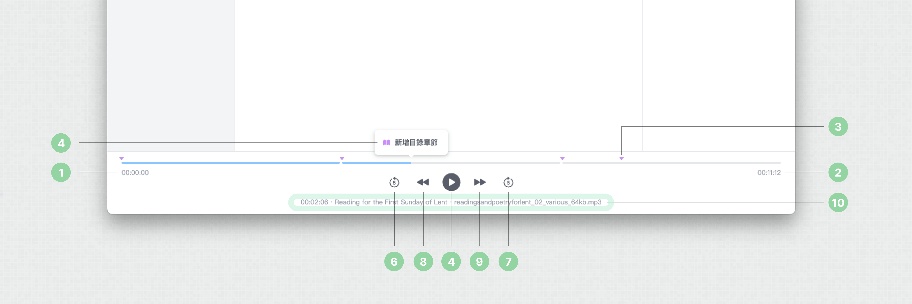

 HyAudio Studio 使用手冊
===================

[HyAudio Studio 使用手冊](#hyaudio-studio-使用手冊)  
[1\. 編輯器介紹](#1-編輯器介紹)  
[2\. 書籍資訊](#2-書籍資訊)  
[3\. 閱讀順序](#3-閱讀順序)  
[4\. 目錄](#4-目錄)  
[5\. 附件](#5-附件)  
[6\. 播放器](#6-播放器)  
[7\. 功能列](#7-功能列)  

1\. 編輯器介紹
---------

當您開啟一個新的有聲書專案，您會看到以下畫面，畫面中包含五個區塊：

1.  **左側選單**：包含書籍資訊區塊與附件區塊。
    
2.  **閱讀順序**：可以將有聲書音檔放入此處，並調整其在有聲書內的播放順序。
    
3.  **目錄**：建立有聲書的目錄。
    
4.  **播放器**：您可以透過播放器預覽有聲書播放的順序與效果。
    
5.  **功能列**：包含儲存專案、驗證、輸出、查看使用說明的功能。
    

2\. 書籍資訊
--------

您可以在書籍資訊區塊裡修改有聲書的基本資訊，包含：

1.  書籍封面
    
2.  書籍名稱（必填）
    
3.  作者（必填）
    
4.  配音員（必填）
    
5.  出版社
    
6.  語言
    
7.  網站
    
8.  出版日期
    
9.  最後編輯日期
    

3\. 閱讀順序
--------

有聲書的音檔將會放在閱讀順序中。 「加入音檔」按鈕：點選後即可添加音檔。

* * *

音檔內容包含：

1.  編號：將會依序播放音檔。
    
2.  名稱：閱讀順序名稱。
    
3.  來源：音檔的檔名。
    
4.  音檔長度：單筆音檔的長度。
    

* * *

滑鼠懸停在一筆音檔上面時，會出現功能列，包含：

1.  播放或暫停按鈕：可以播放或暫停音檔。
    
2.  輸入框：編輯音檔名稱。
    
3.  「加入目錄」按鈕：點擊後可以新增一筆目錄關聯。
    
4.  「刪除」按鈕：點擊後可以刪除音檔。
    
5.  「拖曳」按鈕：透過拖動改變音檔的播放順序。
    

4\. 目錄
------

新增目錄章節：

1.  從閱讀順序：透過「加入目錄按鈕」關聯該音檔到目錄。
    
2.  從播放器：處於暫停狀態時，可以添加關聯目錄。
    

* * *

目錄內容：

1.  編號表示目錄的排列順序。
    
2.  目錄名稱。
    
3.  關聯音檔。
    
4.  時間輸入欄位。
    

* * *

滑鼠懸停在一筆目錄上面時，會出現功能列，包含：

1.  輸入框：修改目錄名稱。
    
2.  「刪除」按鈕：點擊後可以刪除目錄。
    
3.  「拖曳」按鈕：透過拖動改變目錄的順序。
    

5\. 附件
------

1.  點選「附件」頁籤。
    
2.  「上傳附加檔案」按鈕：點擊後可以上傳附加檔案。
    
3.  上傳後顯示附件名稱。
    

* * *

滑鼠懸停在一筆附件上時，會出現功能列，包含：

1.  「加入目錄」按鈕：點擊後可以新增一筆目錄關聯。
    
2.  「刪除」按鈕：點擊後可以刪除音檔。
    

6\. 播放器
-------

1.  開始時間：顯示開始時間
    
2.  結束時間：顯示結束時間
    
3.  目錄戳記：顯示目錄在時間軸上的位置
    
4.  「新增目錄章節」按鈕：可以在暫停的時間點新增目錄關聯。
    
5.  「播放」/「暫停」按鈕：播放或暫停音檔。
    
6.  「往前 5 秒」按鈕：由當前位置往前 5 秒。
    
7.  「往後 5 秒」按鈕：由當前位置往後 5 秒。
    
8.  「前一首」按鈕：播放前一個音檔。
    
9.  「後一首」按鈕：播放後一個音檔。
    
10.  顯示正在播放的時間、音檔與音檔來源。
    

7\. 功能列
-------

1.  儲存專案：將編輯到一半的專案儲存在您指定的資料夾內。
    
2.  驗證：依據 W3C 規範進行驗證。
    
3.  輸出：將您規劃好的有聲書輸出為 .lpf 格式。
    
4.  資訊：檢視使用手冊。
    

